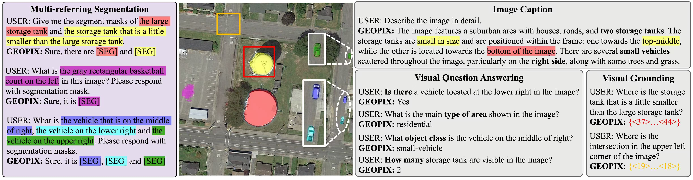

<div align="center">
<h1>GeoPix: Multi-Modal Large Language Model for Pixel-level Image Understanding in Remote Sensing</h1>

[**Ruizhe Ou**](https://github.com/Norman-Ou)<sup>1</sup> · [**Yuan Hu**](https://github.com/Lavender105)<sup>2,*</sup> · **Fan Zhang**<sup>2</sup> · **Jiaxin Chen**<sup>1</sup> · **Yu Liu**<sup>2,3</sup>

<sup>1</sup>Beijing University of Posts and Telecommunications · <sup>2</sup>Peking University · <sup>3</sup>Peking University Ordos Research Institute of Energy <sup>*</sup>corresponding authors

<a href='https://arxiv.org/abs/2501.06828'></a>
<a href='https://huggingface.co/Norman-ou/GeoPix-ft-sior_rsicap'></a>
[](https://www.modelscope.com/models/NormanOU/GeoPix-ft-sior_rsicap)
[](https://openxlab.org.cn/models/detail/NormanOU/GeoPix-ft-sior_rsicap)

</div>

GeoPix is a new state-of-the-art pixel-level multi-modal large language model in remote sensing domain, supporting referring image segmentation and other tasks.



# Releas🔥

- [ ] Release Training Code
    
- [2025.04.12] We release GeoPixInstruct. [HuggingFace🤗]([Norman-ou/GeoPixInstruct](https://huggingface.co/datasets/Norman-ou/GeoPixInstruct))
- [2025.04.10] GeoPix has been accepted by GRSM (IEEE Geoscience and Remote Sensing Magazine).
- [2025.02.20] We release the pre-trained checkpoints, inference code and gradio demo!
- [2025.01.12] We release the [paper](https://arxiv.org/pdf/2501.06828).

**GeoPix: Multi-Modal Large Language Model for Pixel-level Image Understanding in Remote Sensing** [[Arxiv](https://arxiv.org/pdf/2501.06828)]

# Abstract

In this work, we propose GeoPix, a RS MLLM that extends image understanding capabilities to the pixel level. This is achieved by equipping the MLLM with a mask predictor, which transforms visual features from the vision encoder into masks conditioned on the LLM’s segmentation token embeddings. For more details, please refer to the [paper](https://arxiv.org/pdf/2501.06828).

# Demo🚀

## 1. Installation

```sh
conda create -n geopix python=3.10 -y
conda activate geopix
pip install -r requirements.txt
mkdir pretrained_models
```

## 2. Download

You can directly download the model from [Huggingface](https://huggingface.co/InstantX/InstantID), [ModelScope](https://www.modelscope.cn/models/NormanOU/GeoPix-ft-sior_rsicap) or [OpenXLab](https://openxlab.org.cn/models/detail/NormanOU/GeoPix-ft-sior_rsicap). You also can download the model in python script:

```python
# Huggingface
from huggingface_hub import snapshot_download
snapshot_download(repo_id="Norman-ou/GeoPix-ft-sior_rsicap", local_dir="./pretrained_models")

# ModelScope
from modelscope import snapshot_download
model_dir = snapshot_download("NormanOU/GeoPix-ft-sior_rsicap", local_dir="./pretrained_models")
```

Once you have prepared all models, the folder tree should be like:

```
  .
  ├── ...
  ├── model
  ├── pretrained_models
  ├── app.py
  ├── engine.py
  ├── ...
  └── README.md
```

## 3. Start a local gradio demo

Run the following command:

```sh
python app.py
```

Thee instruction is well written. Enjoy our work.


# Inference🔍
Run the following command:

```sh
python inference.py
```

# Citation📑

```
@misc{ou2025geopixmultimodallargelanguage,
      title={GeoPix: Multi-Modal Large Language Model for Pixel-level Image Understanding in Remote Sensing}, 
      author={Ruizhe Ou and Yuan Hu and Fan Zhang and Jiaxin Chen and Yu Liu},
      year={2025},
      eprint={2501.06828},
      archivePrefix={arXiv},
      primaryClass={cs.CV},
      url={https://arxiv.org/abs/2501.06828}, 
}
```

# Acknowledgement

- This work is built upon the [LLaVA](https://github.com/haotian-liu/LLaVA) and [PixelLM](https://pixellm.github.io/)


